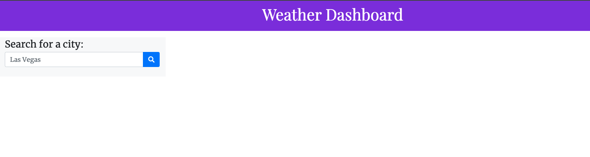

# stunning-robot

## Weather Dashboard - Challenge Assignment 6 Server-Side APIs

- *What was your motivation?*  I wanted to create a website to check the weather in different cities
- *Why did you build this project?*  To show people projects that I have been involved in creating.
- *What problem does it solve?*  It solves the problem of trying to explain what I've created and how I did it, instead of trying to explain it all, I can show them.
- *What did I learn?* I learned how to call information from a server-side API using a key that I create.  As well as reading API documentation to figure out how to do certain things and how to apply that information within my Javascript

## Installation

*What are the steps required to install your project? Provide a step-by-step description of how to get the development environment running.*

Go to https://stephenfudge.github.io/stunning-robot/ and the page should load and function properly. 

Alternatively, if you wish to download the files then you shoud do the following:
Download the index.html file as well as the assets folder and the project should work and function properly. 

## Usage

*Provide instructions and examples for use. Include screenshots as needed.*

Enter a city in the text box that says "Las Vegas" and then you will receive the current weather as well as weather for the next 5 days displayed to you. 
If you search for another city after that, the previously searched cities will show on the left side of the page if you want to revisit them.

Below is a screenshot of what the website should look like upon entry to the site.  In the images folder within assets there is 2 more screenshots on what the site looks like after you have searched for a city. 

## Credits
I used https://coding-boot-camp.github.io/full-stack/apis/how-to-use-api-keys to learn how to use API keys within my own code. I also used https://openweathermap.org/api/one-call-api to assist me with how to call things from this specific server-side API.